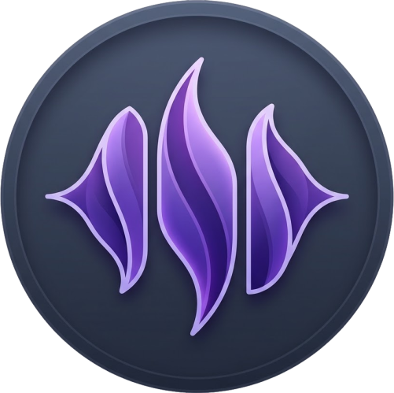
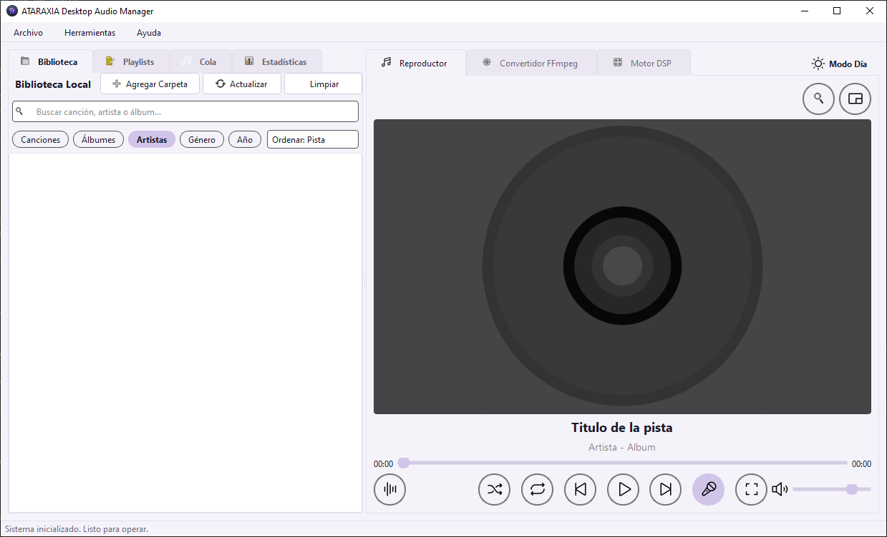
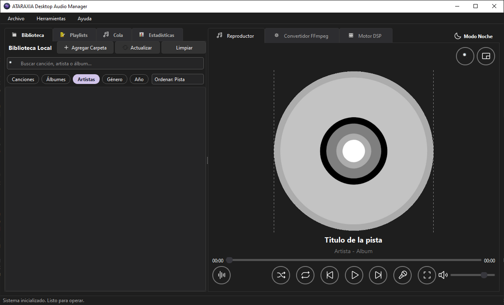

<div align="center">



# Ataraxia Player

**Reproductor de música de escritorio, libre y multiplataforma**

[](https://www.python.org/)
[](https://pypi.org/project/PyQt6/)
[](https://www.gnu.org/licenses/gpl-3.0)
[]()
[]()

[Descargar](#-descargar) · [Capturas](#-capturas) · [Características](#-características) · [Instalación](#-instalación) · [Documentación](#-documentación)

</div>

---

## ¿Qué es Ataraxia Player?

Ataraxia Player es un reproductor de música pensado para **escuchar tu propia biblioteca local** (la que tienes en tu disco duro, en MP3, FLAC, OGG, M4A o WAV) sin depender de servicios en línea ni suscripciones.

> **Para usuarios:** un reproductor sencillo, con buena UI, ecualizador, letras sincronizadas (modo karaoke) y conversión de audio integrada.
>
> **Para desarrolladores:** un proyecto académico de ingeniería de software construido sobre Python 3.11+, PyQt6 y SQLite, con arquitectura MVC, sistema de migraciones de base de datos versionado y tests automatizados.

El nombre "**Ataraxia**" viene del griego *ἀταραξία* — *un estado de calma imperturbable*. Es lo que queremos que sientas escuchando tu música.

---

## Características

### Lo esencial
- Reproducción de **MP3, FLAC, OGG, M4A, WAV** (cualquier formato que soporte FFmpeg)
- Cola de reproducción con **shuffle**, **repetición** (una/todas) y **drag & drop** para reordenar
- **Controles multimedia integrados** con Windows (notificación de pista actual con play/pause/next desde la barra de tareas) y MPRIS en Linux

### Tu biblioteca, organizada
- Escaneo automático de carpetas con detección de cambios
- 5 modos de vista: **Canciones**, **Álbumes**, **Artistas**, **Género** y **Año**
- **Búsqueda instantánea** con SQLite FTS5 (búsqueda full-text con corrección de acentos)
- **Favoritos** marcados con un corazón directamente sobre la carátula
- **Estadísticas de escucha**: top de canciones, álbumes y artistas más reproducidos

### Sonido a tu medida
- **Ecualizador de 10 bandas** con presets (Pop, Rock, Jazz, Clásica…)
- **Filtros DSP** experimentales: pitch shift, reverb
- **ReplayGain** para normalizar el volumen entre canciones automáticamente
- **Visualizador de espectro** en tiempo real

### Letras sincronizadas
- Soporte para archivos **`.lrc`**, **`.srt`** y **`.txt`** locales
- **Descarga automática** desde lrclib.net (opcional, configurable)
- **Modo karaoke**: la línea actual se resalta a medida que avanza la canción

### Carátulas
- Lectura de carátulas incrustadas en los archivos
- **Descarga automática** desde iTunes API si la canción no tiene carátula (opcional)
- **Editor de metadatos** completo: título, artista, álbum, año, género, pista, disco… y carátula

### Conversión de audio
- Convierte entre todos los formatos soportados sin abrir terminales
- Ajuste de bitrate y canales
- Conversión por lotes con progreso visible

### Listas de reproducción
- Crea, edita, elimina playlists
- **Importa y exporta** archivos `.m3u` (compatible con casi cualquier reproductor)
- Reordena con drag & drop

### Apariencia
- **Tema claro y oscuro** con cambio en caliente desde el menú
- **Modo compacto automático**: el reproductor se adapta cuando lo pones en pantalla dividida o reduces la ventana
- **Mini player** flotante para mantenerlo a la vista sin que estorbe

### Robustez
- Base de datos SQLite con **migraciones versionadas** (la app sigue funcionando aunque actualices)
- **Respaldos manuales y automáticos** con un clic
- **Lock multiplataforma** del archivo de BD: protege contra manipulación externa mientras la app está abierta
- Recuperación ante fallos: si una migración falla, se restaura el respaldo automáticamente

---

## Capturas

<div align="center">


| Vista principal |
</div>

<div align="center">


| Tema oscuro |
</div>

---

##  Descargar

### Windows (recomendado para usuarios)

Descarga el instalador desde la página de **[Releases](https://github.com/NocturnalVoid/Ataraxia-Player/releases)** y ejecútalo. Eso es todo.

> ⚠️ **Aviso de SmartScreen**: la primera vez Windows mostrará una advertencia porque el ejecutable no está firmado digitalmente (firmar cuesta cientos de dólares al año). Haz clic en **"Más información"** → **"Ejecutar de todas formas"**. El instalador está construido a partir del código fuente público de este repositorio.

### Linux

Descarga el binario `AtaraxiaPlayer-x86_64.AppImage` de [Releases](https://github.com/NocturnalVoid/Ataraxia-Player/releases), dale permisos de ejecución y arrástralo a tu lanzador favorito:

```bash
chmod +x AtaraxiaPlayer-x86_64.AppImage
./AtaraxiaPlayer-x86_64.AppImage
```

### Desde el código fuente

Si prefieres compilarlo tú mismo o quieres modificarlo, mira la sección **[Instalación para desarrolladores](#-instalación-para-desarrolladores)** más abajo.

---

## Primeros pasos

Cuando abras Ataraxia por primera vez, verás una **bienvenida** que te explica las funciones principales. Después de eso:

1. **Agrega tu música** → pestaña **Biblioteca** → botón **"Agregar Carpeta"** → selecciona la carpeta donde tienes tus canciones.
2. Espera a que se escanee (puede tardar segundos o minutos según el tamaño).
3. Doble clic en cualquier canción para empezar a escuchar.

**Tip:** activa la descarga automática de letras y carátulas en **Archivo → Preferencias → Metadatos y Red**.

---

## Instalación para desarrolladores

### Requisitos

- **Python 3.11** o **3.12** (necesario para `winsdk` en Windows)
- **FFmpeg** instalado y accesible desde el `PATH`
- **Git** para clonar el repositorio

### Pasos

```bash
# 1. Clonar el repositorio
git clone https://github.com/NocturnalVoid/Ataraxia-Player.git
cd Ataraxia-Player

# 2. Crear entorno virtual (recomendado)
python -m venv venv

# Activar venv (Linux/macOS):
source venv/bin/activate
# Activar venv (Windows PowerShell):
.\venv\Scripts\Activate.ps1

# 3. Instalar dependencias
pip install -r requirements.txt

# 4. Ejecutar
python main.py
```

### Instalar FFmpeg

**Windows:** descarga la versión `essentials` desde [gyan.dev](https://www.gyan.dev/ffmpeg/builds/), descomprime y añade la carpeta `bin/` al PATH del sistema.

**Linux (Debian/Ubuntu):**
```bash
sudo apt install ffmpeg
```

**Linux (Arch):**
```bash
sudo pacman -S ffmpeg
```

**macOS (con Homebrew):**
```bash
brew install ffmpeg
```

### Ejecutar las pruebas

```bash
pytest tests/ -v
```

Deberías ver 6 pruebas de la base de datos pasando, incluyendo verificación de constraints, foreign keys, cascadas y full-text search.

### Compilar a ejecutable

**Windows (`.exe`):**
```cmd
python -m PyInstaller --noconsole --onefile ^
  --icon="assets\icons\ataraxia.ico" ^
  --hidden-import=mutagen ^
  --hidden-import=requests ^
  --add-data "assets;assets" ^
  --add-data "src;src" ^
  main.py
```

El ejecutable resultante estará en `dist/main.exe`.

---

## Arquitectura

Ataraxia Player sigue el patrón **Modelo-Vista-Controlador (MVC)** con coordinadores especializados:

```
src/
├── main.py                          → punto de entrada
├── controllers/                     → orquestación
│   ├── main_controller.py           → controlador raíz, conecta todo
│   ├── playback_controller.py       → motor de reproducción
│   ├── library_coordinator.py       → coordinación de la biblioteca
│   ├── playlist_coordinator.py      → gestión de listas
│   ├── queue_coordinator.py         → cola de reproducción
│   └── conversion_controller.py     → conversión de audio
├── models/                          → datos y lógica
│   ├── database_manager.py          → SQLite + lock multiplataforma
│   ├── migrations.py                → migraciones versionadas
│   ├── db_maintenance.py            → respaldos, vacuum, integrity check
│   ├── metadata_manager.py          → lectura/escritura de tags (mutagen)
│   ├── lyrics_parser.py             → parser .lrc, .srt, .txt
│   ├── lyrics_api.py                → cliente lrclib.net
│   └── media_converter.py           → wrapper de FFmpeg
└── views/                           → UI (PyQt6)
    ├── main_window.py
    ├── player_panel.py              → reproductor principal
    ├── library_panel.py
    ├── playlist_panel.py
    ├── queue_panel.py
    ├── converter_panel.py
    ├── dsp_panel.py
    ├── stats_panel.py
    ├── visualizer_widget.py
    ├── metadata_dialog.py
    ├── preferences_dialog.py
    └── welcome_dialog.py
```

### Decisiones técnicas clave

- **SQLite con WAL mode**: permite lecturas concurrentes mientras se escribe (necesario porque la UI consulta la BD en cada cambio de canción).
- **Migraciones versionadas**: el esquema actual es la versión 9. Cada migración se aplica de forma idempotente al arrancar la app.
- **FTS5 (Full-Text Search v5)**: búsqueda instantánea con tokenizer Unicode que ignora acentos.
- **Hilos QThread separados** para operaciones largas: escaneo, descarga de letras, descarga de carátulas, conversión.
- **Lock de BD multiplataforma**: usa `msvcrt.locking()` en Windows y `fcntl.flock()` en Linux/macOS.

Para más detalles consulta `documentacion/ARQUITECTURA.md`.

---

## Documentación

| Documento | Audiencia | Contenido |
|---|---|---|
| `documentacion/MANUAL_USUARIO.md` | Usuarios finales | Cómo usar todas las funciones, paso a paso, con tips |
| `documentacion/ARQUITECTURA.md` | Desarrolladores | Diseño técnico, decisiones, diagramas |
| `documentacion/diagramas/` | Académico | Diagramas UML (clases, ER, casos de uso, arquitectura) en LaTeX y PlantUML |

---

## Música de prueba (opcional)

Si solo quieres probar la app sin tener música propia a mano, puedes descargar algunas pistas libres de derechos:

- **[Free Music Archive](https://freemusicarchive.org/)** — filtra por Creative Commons
- **[Kevin MacLeod](https://incompetech.com)** — música instrumental CC BY 4.0
- **[Bensound](https://www.bensound.com)** — pop/electrónica libre con atribución

> ⚠️ Si vas a probar la descarga automática de carátulas o letras, usa pistas con metadatos reales (título + artista + álbum). Pistas como "track01.mp3" sin info no podrán consultarse en las APIs.

---

## Contribuir

Este es un proyecto académico **estable** pero abierto a contribuciones. Si encuentras un bug o tienes una idea:

1. Abre un **Issue** describiendo el comportamiento esperado vs el actual.
2. Si quieres aportar código, haz un **Fork**, crea una rama (`feature/mi-mejora`) y abre un **Pull Request**.

Antes de mandar cambios:

- Ejecuta `pytest tests/` y asegúrate de que todo pasa.
- Mantén el estilo de código existente (snake_case, docstrings en español).
- Si añades una migración de BD, añade el caso a `tests/test_database_constraints.py`.

---

## Licencia

Ataraxia Player se distribuye bajo la **GNU General Public License v3.0** (GPL-3.0).

Esto significa que **puedes** usarlo, estudiarlo, modificarlo y redistribuirlo libremente, siempre que **mantengas la misma licencia** en los trabajos derivados y **publiques el código fuente** de tus modificaciones.

Ver `LICENSE` para el texto completo.

### Software de terceros

Ataraxia integra componentes con sus propias licencias:

| Componente | Licencia | Uso |
|---|---|---|
| **FFmpeg** | GPL-3.0 (build "essentials" de gyan.dev) | Conversión y decodificación de audio |
| **PyQt6** | GPL v3 / Comercial | Interfaz gráfica |
| **mutagen** | GPL-2.0+ | Lectura/escritura de metadatos de audio |
| **requests** | Apache 2.0 | Peticiones HTTP a APIs externas |
| **SQLite** | Public Domain | Motor de base de datos |
| **lrclib.net** | API pública, no comercial | Letras sincronizadas |
| **iTunes Search API** | Términos de Apple | Carátulas |

Ver `CREDITS.txt` para más detalles.

---

## Equipo

Proyecto desarrollado como parte de la materia de **Ingeniería de Software**, 8° semestre, **Instituto Tecnológico Superior de Irapuato (ITESI)**.

- BORJA MOSQUEDA, Iván Gerardo
- DIOSDADO ZAMORA, Adán Gabriel
- GÓMEZ RODRÍGUEZ, Fernando Enrique
- MEDRANO GARCÍA, Miguel Ángel
- MONCADA MACIEL, Ricardo

**Docente:** Ing. Francisco Javier Jiménez Witrago

---

## Soporte y contacto

- **¿Un bug?** Abre un [issue](https://github.com/NocturnalVoid/Ataraxia-Player/issues)
- **¿Una idea?** Igual, abre un issue con la etiqueta `enhancement`
- **¿Una pregunta general?** Discusiones en la pestaña [Discussions](https://github.com/NocturnalVoid/Ataraxia-Player/discussions)

---

<div align="center">

Hecho con ☕ y mucho 🎧 en México.

⭐ Si te gustó el proyecto, dale una estrella en GitHub.

</div>
